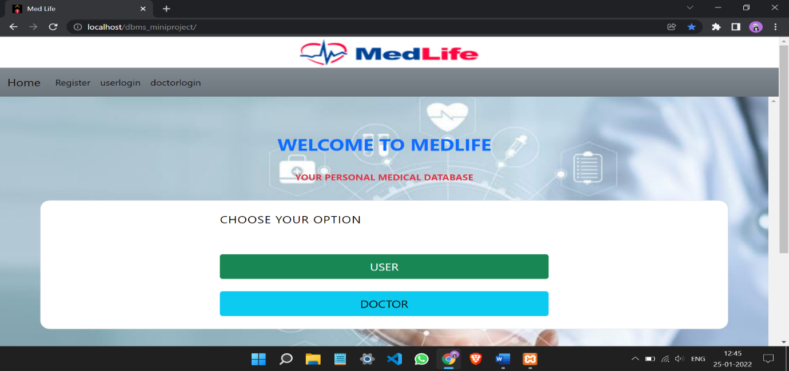
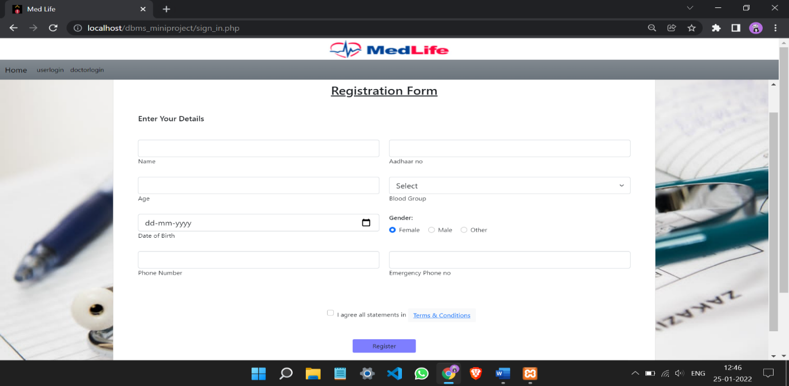
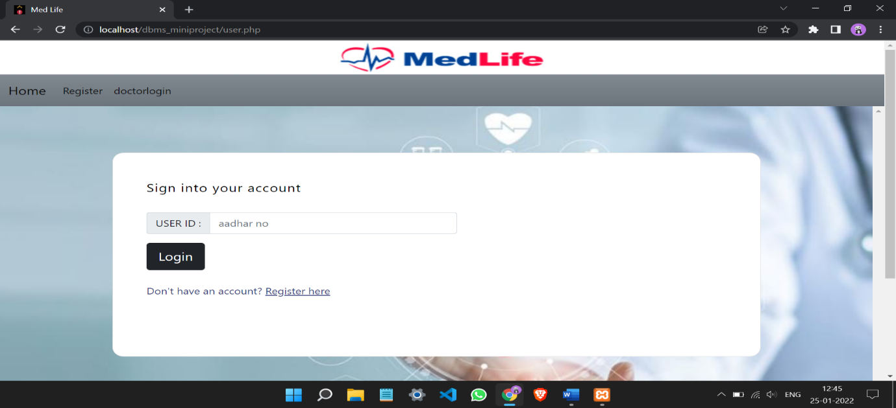
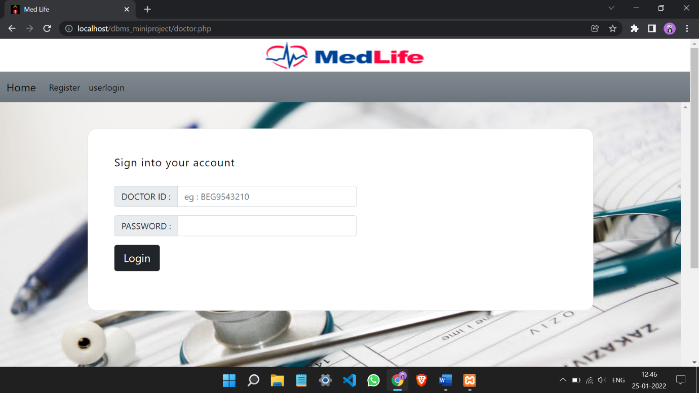
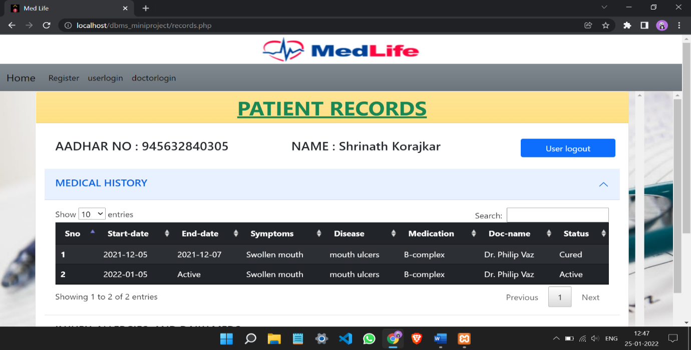
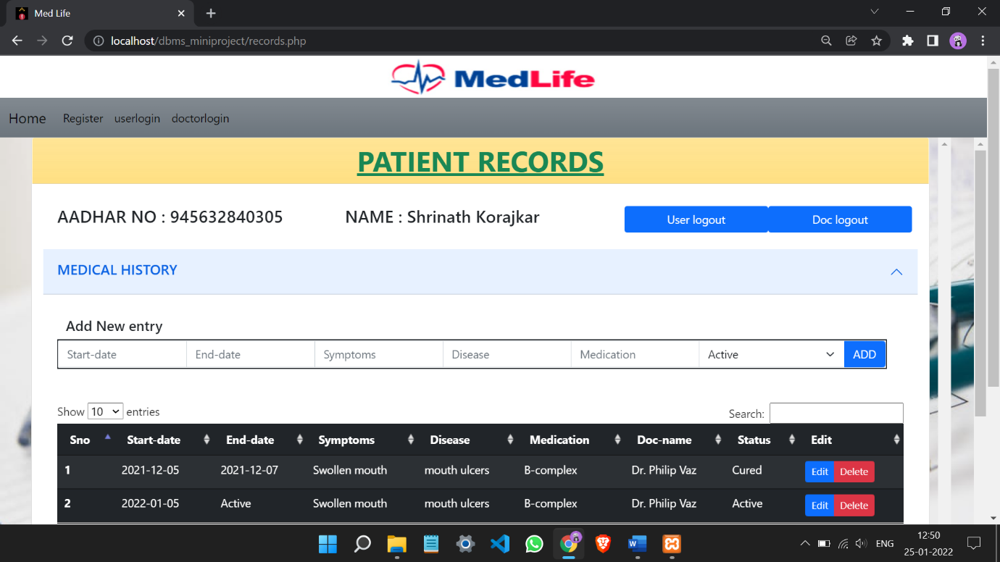
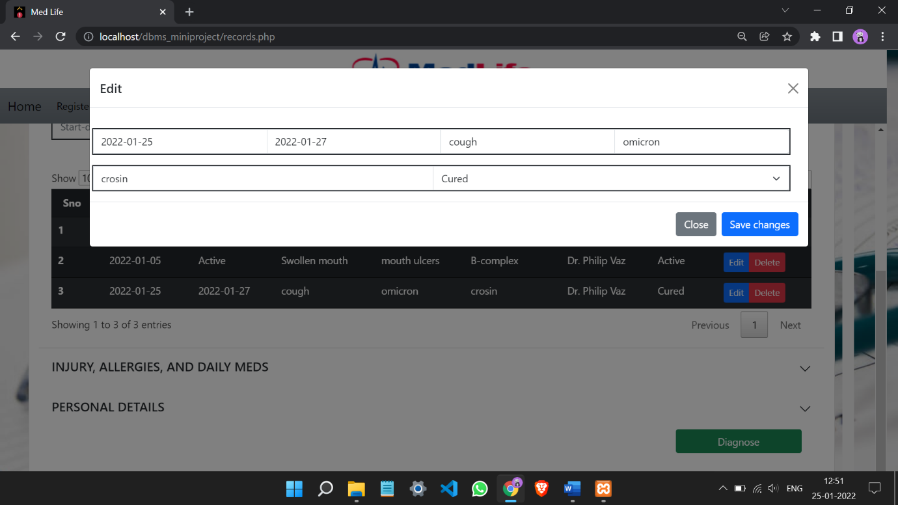
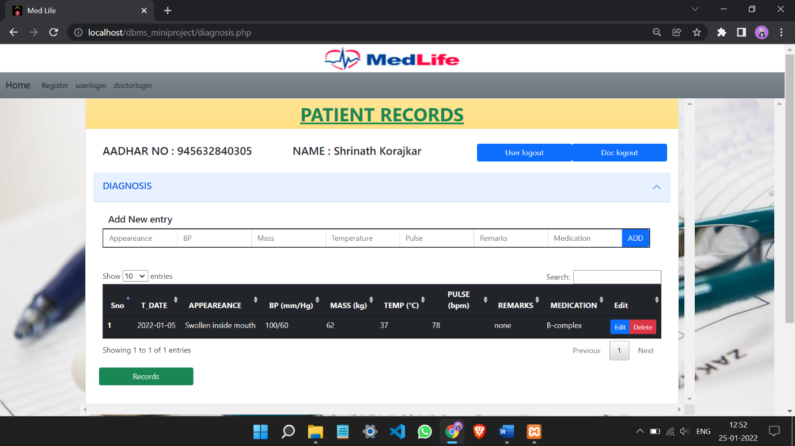

# My Medic Life
It is a DBMS mini project.
A website that uses universal unique id to keep, maintain Medical records of each individual throughout his/her life. It can be accessed by anyone, anywhere in the world and helpful for Doctors to diagnose their patient effectively.

### ABSTRACT
The purpose of the project is to develop a software which stores medical history of an individual identified by a global unique id. It is user friendly simple, fast, and cost – effective. It deals with the collection of patient’s information, medical history, personal and medical details, diagnosis details, etc. Traditionally, it was done manually. The main function of the system is register and store patient details and doctor details and retrieve these details as and when required, and also to manipulate these details meaningfully. System input contains patient details, diagnosis details, while system output is to get these details on to the screen. The Personal Medical Database System can be entered for doctor using a doctor id and password and for patients using their Aadhaar number. It is accessible either by patient or doctor but only the doctor is having permission to add data into the database. The data can be retrieved easily by anyone with the help of Aadhaar number. The data are well protected for personal use and makes the data processing very fast. It can be accessed from any part of world by the user and in any clinic, hospital, medical Institutes by any doctor.

## Project Setup and Run
**software requirements**
1. [XAMPP](https://www.apachefriends.org/download.html)

**To Run**
1. Download the zip file of the code
2. Extract the file and copy xampp in htdocs folder
3. Paste inside root directory (for xampp xampp/htdocs, for wamp wamp/www, for lamp var/www/html)
4. Open PHPMyAdmin (http://localhost/phpmyadmin)
5. Create a database with name medlifedb
6. Import querries.sql file (given inside the zip package in assets folder)
7. Run the script http://localhost/MyMedicLife/

## SCREENSHOTS
**Home page**

**Registration page**

**User Login page**

**Doctor Login page**

**Users View page**

**Doctors View page**

**Edit page**

**Diagnose page**

